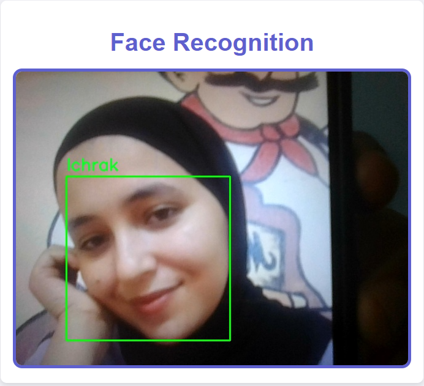

# Facial Recognition with Flask

This project uses Flask to create a web application that performs real-time facial recognition using `dlib` and `face_recognition`. It captures video from a webcam, detects faces, and identifies them against a reference image. The detected faces are highlighted with bounding boxes and labeled as "Ichrak" or "Unknown."

## Features

- Real-time face detection and recognition.
- Labels faces as "Ichrak" or "Unknown" based on the reference image.
- Displays live video feed with bounding boxes and labels.

## Interface

